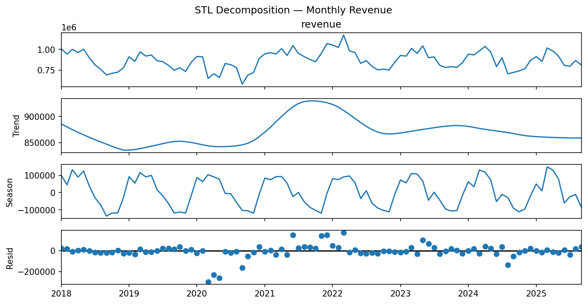
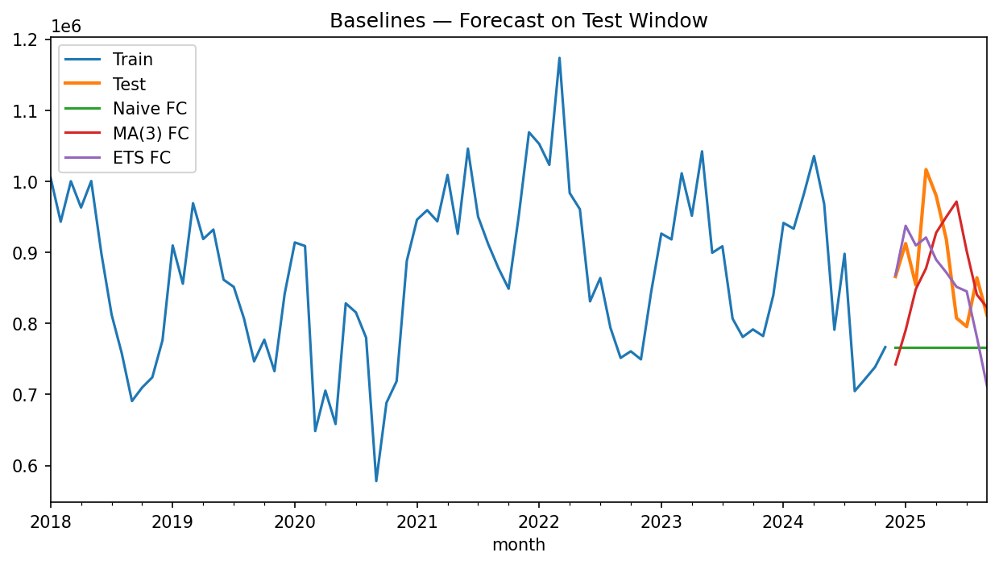

# JungleCart – 02 Revenue Trend Forecasting

## Overview
This repository contains the **revenue trend forecasting project** for **JungleCart**, a premium outdoor & adventure-gear e-commerce platform.  
It demonstrates a **production-style analytics workflow**: from raw transactional data to robust 6–12 month revenue forecasts with clear visuals and business recommendations.

## Objectives
* **Historical analysis** – reveal long-term trends, seasonality and macro-economic shocks (e.g. COVID-19, supply-chain disruptions).  
* **Model building** – compare time-series forecasting techniques:
  - Naive & Moving Average baselines
  - ETS (Triple Exponential Smoothing)
  - SARIMA and SARIMAX (with marketing/SEO exogenous drivers)
* **Forward forecast** – produce 6- and 12-month revenue projections with 95 % confidence intervals.
* **Business impact** – guide inventory planning, marketing budgets and strategic growth decisions.

---

## Key Visuals

### 1️⃣ STL Decomposition — Monthly Revenue
<p align="center">
  
</p>

* **Trend:** Persistent upward growth with a post-2021 structural lift.  
* **Seasonality:** Strong annual pattern with a dominant holiday peak.  
* **Residual:** Noise concentrated around COVID and supply-chain events.

### 2️⃣ Baselines — Forecast on Test Window
<p align="center">
  
</p>

* Compares **Naive**, **Moving Average (k=3)** and **ETS (AAA)** forecasts against the held-out test set.  
* ETS captures both trend and seasonality, outperforming simple baselines.

---

## Repository Structure

├─ README.md
├─ environment.yml / requirements.txt    # environment specification
├─ data/                                 # raw & processed CSVs
├─ notebooks/                            # Jupyter analysis notebooks
├─ src/                                   # reusable Python modules
├─ outputs/
│   ├─ figures/
│   │   ├─ stl_decomposition_monthly.png
│   │   └─ baseline_model_forecasts.png
│   ├─ model_metrics.csv
│   ├─ forecast_6m.csv
│   └─ forecast_12m.csv
└─ docs/                                 # methodology, findings, next steps

---

## Quickstart
```bash
# Option 1: conda
conda env create -f environment.yml
conda activate junglecart-forecast

# Option 2: pip
python -m venv .venv
source .venv/bin/activate
pip install -r requirements.txt

Launch the main notebook:

jupyter lab notebooks/02_revenue_trend_forecasting.ipynb

All figures and CSV artefacts will be written to outputs/.

⸻

Key Findings
	•	Durable growth: Revenue more than doubled since 2018 with a structural post-COVID uplift.
	•	Predictable seasonality: Strong Nov–Dec holiday peaks and secondary mid-year outdoor surge.
	•	Macro shocks visible: COVID-19 and supply-chain disruptions create short-term volatility.
	•	Model performance: SARIMAX with marketing/SEO regressors achieves the lowest RMSE and sMAPE, beating ETS and simpler baselines.

⸻

Next Steps
	1.	Inventory planning – raise safety stock 6–10 weeks ahead of holiday peaks.
	2.	Marketing strategy – front-load SEO and paid campaigns before seasonal surges.
	3.	Model ops – schedule a monthly refresh; monitor forecast CI bands for risk management.

⸻

Goal: Provide a client-ready, reproducible blueprint for time-series forecasting that turns raw e-commerce data into actionable business insights.

